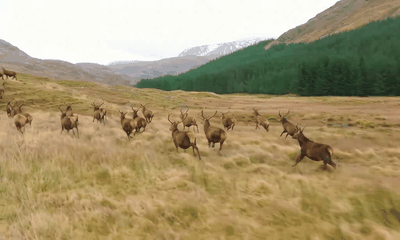

## Zero-shot Novel View Synthesis via Adaptive Modulating Video Diffusion Process

### Visual Results
#### Single view input
         

#### Multi-view input (2 views)
         

#### Monocular video input
         

#### 360° NVS
  


### Dependencies

* Linux
* Anaconda 3
* Python 3.9
* CUDA 12.0
* RTX A6000

### Installing

To get started, please create the virtual environment by:
```
python -m venv .env
source .env/bin/activate
```
Please install the PyTorch by:
```
pip install torch==2.2.1 torchvision==0.17.1 torchaudio==2.2.1 --index-url https://download.pytorch.org/whl/cu121
```
We use PyTorch 2.2.1 with CUDA 12.0, please install the version corresponding to your CUDA.

Please install the [diffusers](https://huggingface.co/docs/diffusers/index) by:
```
pip install diffusers["torch"] transformers
pip install accelerate
pip install -e ".[torch]"
```
Please install required packages by:
```
pip install -r requirements.txt
```
### Inference

Run
```
bash demo.sh
```

### Our pipeline for abitrary trajectory
#### Prepare depth model
First please prepare [Depth Anything V2](https://github.com/DepthAnything/Depth-Anything-V2). As our pipeline read depth as npy file, so please edit the [run.py](https://github.com/DepthAnything/Depth-Anything-V2/blob/main/run.py) for saving predicted depth maps as npy:
1. add this after [line 57](https://github.com/DepthAnything/Depth-Anything-V2/blob/main/run.py#L57)
```
depth_np = depth
```
2. add this after [line 73](https://github.com/DepthAnything/Depth-Anything-V2/blob/main/run.py#L73)
```
np.save(os.path.join(args.outdir, os.path.splitext(os.path.basename(filename))[0] + '.npy'),depth_np)
```
#### Prepare your image 
Put your image to a directory, e.g. `/path_to_img`.
```
DIR_PATH=/path_to_img
IMG_PATH=/path_to_img/001.jpg
DEPTH_PATH="${DIR_PATH}/depth"
mkdir -p "$DEPTH_PATH"
```

Predict depth for your image
```
cd /your_path_to_Depth-Anything-V2
python run.py --encoder vitl --img-path "$IMG_PATH" --outdir "$DEPTH_PATH"
```
#### Run the pipeline
```
cd /your_path_to_NVS_Solver
python svd_interpolate_single_img_traj.py --image_path "$IMG_PATH" --folder_path "$DIR_PATH" --iteration any_trajectory --radius 40 --end_position 30 2 -10 --lr 0.02 --weight_clamp 0.2
```
`--raidus` is the distance from the original camera and the center of the image, i.e., the depth of the center pixel, may need to change to accommodate different images. The original camera position is set to `[radius,0,0]`.

`--end_position` is where the camera trajectory ends at as you like. It need three inputs for the camera position in X, Y, Z. The trajectory will be generated between original camera position to end position and the camera will always face to the center object of the given image.


## Acknowledgement
Thanks for the following wonderful works: [Diffusers](https://huggingface.co/docs/diffusers/index), [Depth Anything](https://github.com/LiheYoung/Depth-Anything), [Depth AnythingV2](https://github.com/DepthAnything/Depth-Anything-V2)..
